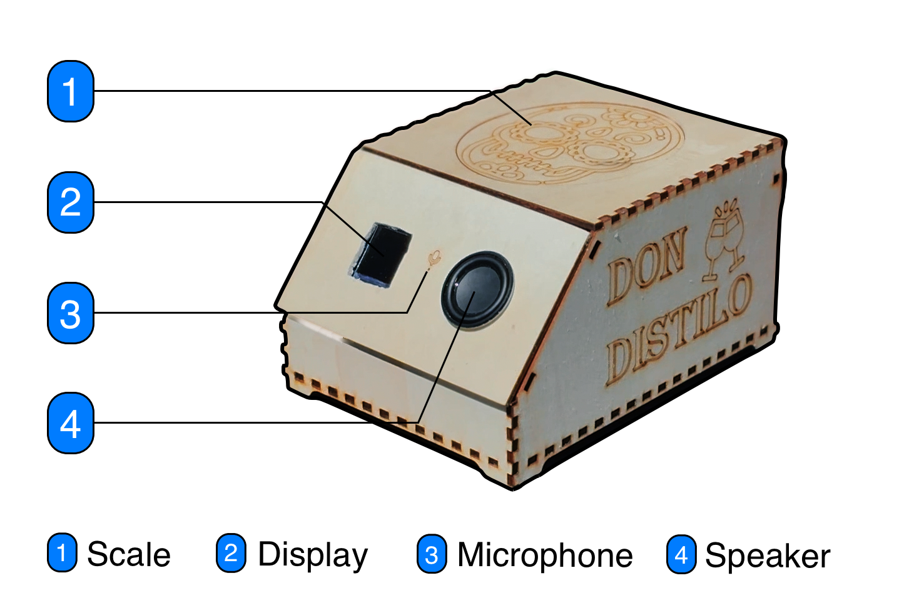

# Don Distillo - The AI Cocktail Robot

This repository contains the software for "Don Distillo", an AI-powered cocktail robot. Don Distillo helps you discover new cocktail recipes and assists you in mixing them to perfection.



Don Distillo is designed to be a hands-free cocktail assistant. You can control it entirely with your voice, and it will talk back to you, guiding you through the process of making a delicious cocktail. The robot is powered by a Large Language Model (LLM), which allows for natural and intuitive interaction.

https://github.com/user-attachments/assets/4040f2ff-ef4b-4da3-9fca-8928fee331a7

### Features

- **Voice-controlled:** Just tell Don Distillo what you want to do.
- **Recipe discovery:** Ask for cocktail ideas based on ingredients you have or flavors you like.
- **Guided mixing:** The robot uses a scale and a display to help you pour the right amount of each ingredient.
- **Speech interaction:** Don Distillo provides audio feedback and instructions.


## Requirements

### Software

- [Docker](https://www.docker.com/)
- [Docker Compose](https://docs.docker.com/compose/install/)
- [PlatformIO](https://platformio.org/install/) (for flashing the ESP32 firmware)

### Hardware

- The cocktail robot itself (or the parts to build one).
  - **Microcontroller:** ESP-32-Pico-Kit-1  
  - **Scale:** Elecrow Crowtail-Weight Sensor V2.0  
  - **Microphone:** INMP441 MEMS  
  - **Speaker Driver:** SparkFun I2S Audio Breakout  
  - **Display:** Waveshare 1.3-inch LCD

### GPU Acceleration (Optional)

For running the services in GPU mode, you will need:

- An NVIDIA GPU
- NVIDIA driver version ≥ 12.9
- The [NVIDIA Container Toolkit](https://docs.nvidia.com/datacenter/cloud-native/container-toolkit/latest/install-guide.html)

## Usage

This project uses a microservice architecture and Docker Compose to orchestrate the different services.

### Environment Variables

Before running the services, you need to create a `.env` file in the root of the repository. You can copy the provided sample file:

```bash
cp .env.sample .env
```

Then, edit the `.env` file with your configuration.

**Required for all configurations:**

- `ESP_ADDR`: The IP address of your ESP32.
- `OPENAI_API_KEY`: Your OpenAI API key.

**Required only for CPU mode (`docker-compose.cpu.yml`):**

When running in CPU mode, the TTS service uses Azure's cloud-based text-to-speech. You will need to provide the following credentials:

- `AZURE_SPEECH_KEY`: Your Azure Speech API key.
- `AZURE_REGION`: The Azure region for your Speech service.

When running in GPU mode (`docker-compose.gpu.yml`), the TTS service runs a local model and does not require these keys.

### Flashing the Firmware

1.  Connect the ESP32 to your computer.
2.  Navigate to the firmware directory:

    ```bash
    cd firmware/esp
    ```

3.  Build and upload the firmware:

    ```bash
    pio run -t upload
    ```

### Running the Services

> [!IMPORTANT]
> Make sure the ESP32 is running and connected to the network before starting the services.

You can run the services in either CPU or GPU mode.

**CPU Mode:**

```bash
docker-compose -f docker-compose.cpu.yml up --build
```

**GPU Mode:**

```bash
docker-compose -f docker-compose.gpu.yml up --build
```

## Architecture

> [!NOTE]
> Each service has its own `README.md` for further information (see `services/`).


## Attribution

Portions of this project are based on the [Waveshare 1.3-inch LCD HAT C library](https://files.waveshare.com/upload/b/bd/1.3inch_LCD_HAT_code.7z) (© Waveshare).
